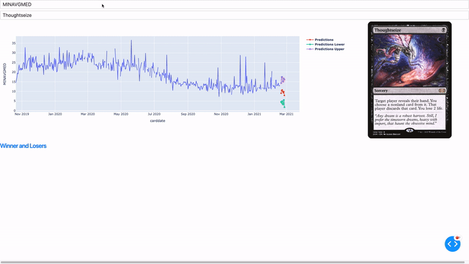
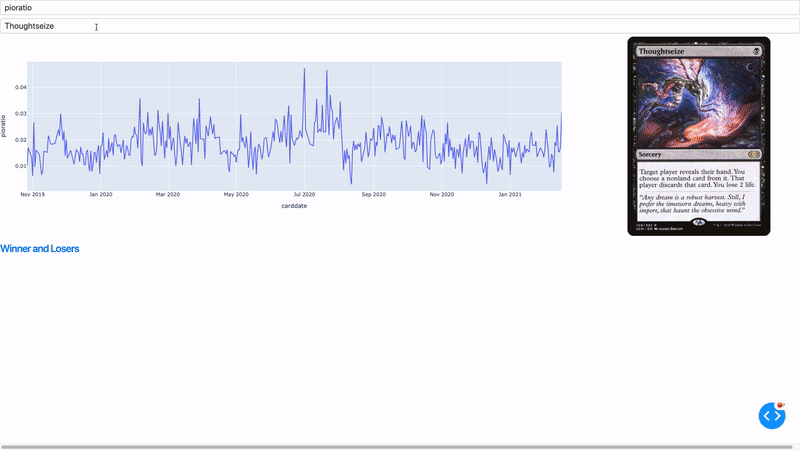
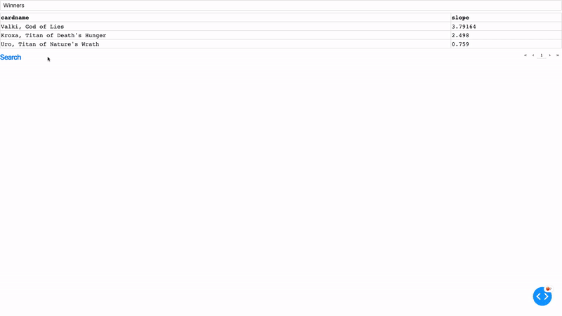

<!-- 

 -->

Check out the app at https://mtgstocksclone.com! This is still a work in progress, I need to 
figure out how to incorporate new data sources and improve the UI.

This dash app displays historical price information of magic:the gathering cards,
as well as 7 day forecasts of prices generated using Amazon Sagemaker's DeepAR
algorithm. You can also look at the the historical information of the predictors
used in the algorithm.

<!--  -->

There is another page which is used to display cards which have recently increased
or decreased in value.

